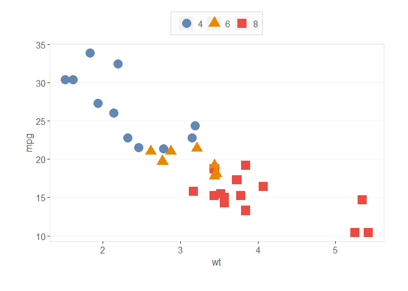
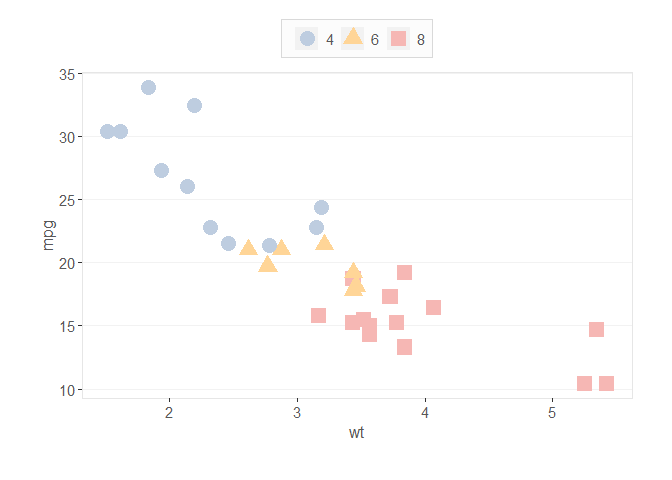
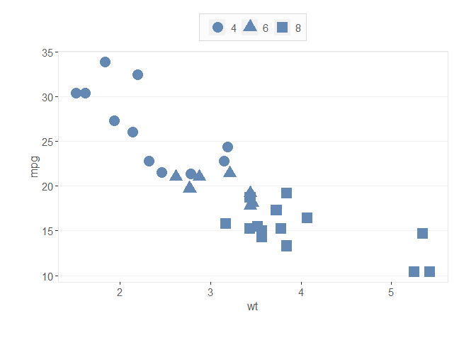

DBC Style Guide Usage and Examples
================
Daniel Carpenter

- <a href="#overview" id="toc-overview"><span
  class="toc-section-number">1</span> Overview</a>
- <a href="#installation-of-package"
  id="toc-installation-of-package"><span
  class="toc-section-number">2</span> Installation of Package</a>
- <a href="#ggplot2-integration" id="toc-ggplot2-integration"><span
  class="toc-section-number">3</span> <code>ggplot2</code> Integration</a>
  - <a href="#create-a-basic-plot-structure"
    id="toc-create-a-basic-plot-structure"><span
    class="toc-section-number">3.0.1</span> Create a basic plot
    structure</a>
  - <a href="#use-multiple-colors" id="toc-use-multiple-colors"><span
    class="toc-section-number">3.1</span> Use Multiple Colors</a>
    - <a href="#default-color-palette" id="toc-default-color-palette"><span
      class="toc-section-number">3.1.1</span> Default Color Palette</a>
    - <a href="#override-color-with-fill"
      id="toc-override-color-with-fill"><span
      class="toc-section-number">3.1.2</span> Override Color with Fill</a>
  - <a href="#use-only-1-color" id="toc-use-only-1-color"><span
    class="toc-section-number">3.2</span> Use only <code>1</code> Color</a>
- <a href="#colors-deep-dive" id="toc-colors-deep-dive"><span
  class="toc-section-number">4</span> Colors Deep Dive</a>
  - <a href="#what-colors-are-available"
    id="toc-what-colors-are-available"><span
    class="toc-section-number">4.1</span> What Colors are Available?</a>
    - <a href="#fill-colors" id="toc-fill-colors"><span
      class="toc-section-number">4.1.1</span> Fill colors</a>
    - <a href="#line-colors" id="toc-line-colors"><span
      class="toc-section-number">4.1.2</span> Line colors</a>
    - <a
      href="#base-colors-like-the-ones-on-the-navy-background-of-slide-decks"
      id="toc-base-colors-like-the-ones-on-the-navy-background-of-slide-decks"><span
      class="toc-section-number">4.1.3</span> Base colors, like the ones on
      the navy background of slide decks</a>
    - <a href="#text-background-border-and-greyed-out-colors"
      id="toc-text-background-border-and-greyed-out-colors"><span
      class="toc-section-number">4.1.4</span> Text, Background, Border, and
      Greyed out colors</a>
  - <a href="#how-to-get-1-color" id="toc-how-to-get-1-color"><span
    class="toc-section-number">4.2</span> How to get <code>1</code>
    color?</a>
  - <a href="#how-to-get-1-colors" id="toc-how-to-get-1-colors"><span
    class="toc-section-number">4.3</span> How to get <code>&gt;1</code>
    colors</a>

<br>

# Overview

> - Package that streamlines color palette usage, adapated from the
>   [Tableau 10
>   Palette](https://www.tableau.com/blog/colors-upgrade-tableau-10-56782)  
> - Leverages `ggplot2`-like functionality  
> - See colorblind statistics for the [fill
>   palette](https://davidmathlogic.com/colorblind/#%23BECDE0-%23FFD597-%23F6B7B4-%23BEE0D2-%23E4C6DC-%23BDDBE1-%23F7E5B3-%23DCDADA-%23FCC8DA-%23E5CFC5)
>   and the [color (*line*)
>   palette](https://davidmathlogic.com/colorblind/#%236388B4-%23E68900-%23EB4B43-%2354AC88-%23B07AA1-%233C9DAA-%23C5A952-%238A807E-%23D16D91-%23945430)

<br>

# Installation of Package

``` r
# Install devtools if not installed (for GitHub Package)
if (!require("devtools"))   install.packages("devtools")

# Install the styles repository
remotes::install_github("Daniel-Carpenter/styles")
```

# `ggplot2` Integration

``` r
# Retrieve theme with helpful theme functions
library(styles)
library(ggplot2)
```

### Create a basic plot structure

> Does *NOT* include DBC Styles

``` r
basePlot <- ggplot(data = mtcars,
               aes(x     = wt,
                   shape = as.factor(cyl),
                   color = as.factor(cyl),
                   y     = mpg
                   )
               ) +
          geom_point(size = 5)
basePlot # Display
```


<br>

## Use Multiple Colors

### Default Color Palette

> Using DBC Style

``` r
basePlot +
  
  # Use the DBC color palette
  scale_color_dbc() +
  
  # Get the DBC ggplot theme
  theme_dbc()
```



<br>

### Override Color with Fill

> Using DBC Style

``` r
basePlot +
  
  # Use the DBC Fill palette (override)
  scale_color_manual(values = scale_dbc('fill', 3) ) +
  
  # Get the DBC ggplot theme
  theme_dbc()
```



<br>

## Use only `1` Color

> Using DBC Style

``` r
basePlot + 
  
  # Use only a single color (note using line palette)
  geom_point(color = scale_dbc('color', 'blue'),
             size  = 5) +
  
  # Get the DBC ggplot theme
  theme_dbc()
```



<br>

# Colors Deep Dive

## What Colors are Available?

- Notice `displayNames = TRUE`, which show you what hex codes are
  associated with the color names.

- Default is `displayNames = FALSE` for best functionality with plotting

### Fill colors

``` r
scale_dbc('fill', displayNames = TRUE)
```

         blue    orange       red     green    purple     blue1    yellow      grey 
    "#BECDE0" "#FFD597" "#F6B7B4" "#BEE0D2" "#E4C6DC" "#BDDBE1" "#F7E5B3" "#DCDADA" 
         pink       tan 
    "#FCC8DA" "#E5CFC5" 

### Line colors

``` r
scale_dbc('color', displayNames = TRUE)
```

         blue    orange       red     green    purple     blue1    yellow      grey 
    "#6388B4" "#E68900" "#EB4B43" "#54AC88" "#B07AA1" "#3C9DAA" "#C5A952" "#8A807E" 
         pink       tan 
    "#D16D91" "#945430" 

### Base colors, like the ones on the navy background of slide decks

``` r
scale_dbc('base', displayNames = TRUE)
```

         navy     navy1     navy2 
    "#3F4953" "#394149" "#2D343B" 

### Text, Background, Border, and Greyed out colors

- These are all separate since usually only selecting one

``` r
scale_dbc('text')       # Text (dark gray) 
```

    [1] "#585858"

``` r
scale_dbc('background') # Background (white)
```

    [1] "#FAFAFA"

``` r
scale_dbc('border')     # Border (light gray)
```

    [1] "#E6E6E6"

``` r
scale_dbc('grayedOut')  # (Very light gray)
```

    [1] "grey87"

<br>

## How to get `1` color?

``` r
# Single color from the fill palette
scale_dbc('fill', 'red')
```

    [1] "#F6B7B4"

``` r
# Single color from the base palette
scale_dbc('base', 'navy')
```

    [1] "#3F4953"

<br>

## How to get `>1` colors

``` r
# Get the first 3 colors in the line palette
scale_dbc('color', 3)
```

    [1] "#6388B4" "#E68900" "#EB4B43"

``` r
# Get the last 3 colors in the fill palette
scale_dbc('color')[6:8]
```

    [1] "#3C9DAA" "#C5A952" "#8A807E"

``` r
# Or access specific colors all at once
scale_dbc('color', 'blue', 'orange', 'green', 'yellow')
```

    [1] "#6388B4" "#E68900" "#54AC88" "#C5A952"

<br>

------------------------------------------------------------------------
