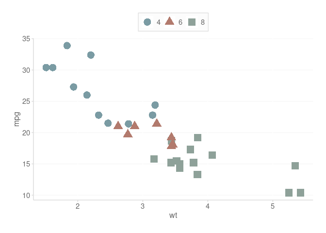
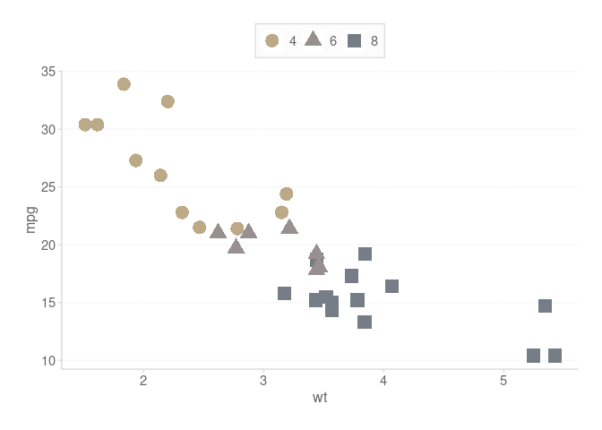
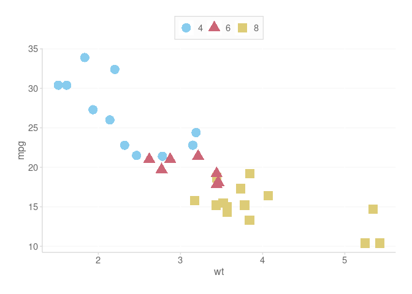

<!-- README.md is generated from README.Rmd. Please edit that file -->

# `styles`

<!-- badges: start -->

<!-- badges: end -->

## Overview

> - Brand in `ggplot2`
> - Package that streamlines color palette usage, initially adapted from
>   the [Tableau 10
>   Palette](https://www.tableau.com/blog/colors-upgrade-tableau-10-56782)
> - See colorblind statistics for the [fill
>   palette](https://davidmathlogic.com/colorblind/#%23BECDE0-%23FFD39F-%23FFB5B3-%23B4DFCE-%23CDC9E0-%23F2D4A0-%23C3C6D2-%23E6D7D7)
>   and the [color (*line*)
>   palette](https://davidmathlogic.com/colorblind/#%237996B9-%23DBA657-%23C86D6A-%2383AF9E-%23928EA4-%23C2A570-%23828591-%23BAABAB)
> - ***PLEASE SEE THE PACKAGE <u>VIGNETTE</u> FOR MORE DETAILED
>   EXAMPLES***

<br>

## Installation of Package

You can install the development version of styles from
[GitHub](https://github.com/) with:

``` r
# Install devtools if not installed (for GitHub Package)
if (!require("devtools"))   install.packages("devtools")

# Install the styles repository
remotes::install_github("Daniel-Carpenter/styles", build_vignettes = TRUE)
```

## Viewing the Vignette

To see in-depth documentation of the package, please uncomment and issue
the following commands.

``` r
# See what vignettes are available
browseVignettes('styles')
```

## Examples

``` r
library(styles)
```

### Create a basic plot structure

> Plot that does *NOT* include Styles

``` r
library(ggplot2)

basePlot <- ggplot(data = mtcars,
                   aes(x     = wt,
                       shape = as.factor(cyl),
                       color = as.factor(cyl),
                       y     = mpg
                   )
) +
  geom_point(size = 5)
basePlot # Display
```


### Use Multiple Colors

#### Default Color Palette

> Using Style

``` r
basePlot +
  
  # Use the color palette
  scale_color_dc() +
  
  # Get the ggplot theme
  theme_dc()
```



#### Override Color with Fill

> Using Style

``` r
basePlot +
  
  # Use the Fill palette (override)
  scale_color_dc(overrideWithFill = TRUE) +  
  
  # Get the ggplot theme
  theme_dc()
```


### Use only `1` Color

> Using Style

``` r
basePlot + 
  
  # Use only a single color (note using line palette)
  geom_point(color = scale_dc('base', 'base2'),
             size  = 5) +
  
  # Get the ggplot theme
  theme_dc()
```


### Darken Text when Over Filled Elements

``` r
ggplot(mtcars, aes(y = mpg, x = wt, color = as.factor(cyl))) +
  geom_point(aes(fill = as.factor(cyl)),
             size = 10,
             pch = 21,
             color = 'transparent',
             alpha = 0.9
  ) +
  geom_text(aes(label = round(mpg, 0))) +
  scale_fill_dc() +
  
  # KEY - darken the text so that it is easier to view
  # Over fill
  scale_color_dc(darkenPaletteForTextGeoms = TRUE) +
  theme_dc()
```


### Offset or Reverse Order of Colors

``` r
# Offset the colors by 1
basePlot + scale_color_dc(colorOffset = 5)
```



``` r

# reverse the order of the palette
basePlot + scale_color_dc(reverseOrder = TRUE)
```


### Override the palette with a color blind palette

``` r
# Use color blind friendly palette (works with fill too)
basePlot + scale_color_dc(useColorBlindPalette = TRUE)
```



``` r

# Change the palette (can use cols4all::c4a_palettes() to try others)
# Also, can demo others in GUI using cols4all::c4a()
basePlot + scale_color_dc(useColorBlindPalette = TRUE, 
                          colorBlindPaletteName = 'color_blind')
```


## Numeric Formats

> Mainly for quick financial axis formatting

``` r
kDollarsFormat(1000,          scaleUnit = 'K')
#> [1] "$1 K"
kDollarsFormat(1000000,       scaleUnit = 'M')
#> [1] "$1 MM"
kDollarsFormat(1000000,       scaleUnit = 'MM')
#> [1] "$1 MM"
kDollarsFormat(1000000000,    scaleUnit = 'B')
#> [1] "$1 B"
kDollarsFormat(1500000000000, scaleUnit = 'T')
#> [1] "$1.50 T"
kDollarsFormat(1000000,       scaleUnit = 'M', useDollarSign = FALSE)
#> [1] "1 MM"
```

## Colors Deep Dive

### What Colors are Available?

- Notice `displayNames = TRUE`, which show you what hex codes are
  associated with the color names.

- Default is `displayNames = FALSE` for best functionality with plotting

#### Fill colors

``` r
scale_dc('fill', displayNames = TRUE)
#>      blue       red     green    purple    orange    yellow   purple1      gray 
#> "#a8d3de" "#f2a896" "#c2dcd1" "#c7bbdb" "#f7d2b4" "#fee6ba" "#d0c3c5" "#a2acb7"
```

#### Accent colors

``` r
scale_dc('color', displayNames = TRUE)
#>      blue       red     green    purple    orange    yellow   purple1      gray 
#> "#7a9ba3" "#b27a6d" "#8ea199" "#9289a1" "#b69a83" "#bba988" "#988f90" "#767d86"
```

#### Blue and Gray colors, like the background of slide decks

``` r
scale_dc('base', displayNames = TRUE)
#>     base1     base2     base3     base4 
#> "#bfd1ba" "#93a28f" "#596b59" "#3c493c"
scale_dc('gray', displayNames = TRUE)
#>     white    gray11    gray10     gray9     gray8     gray7     gray6     gray5 
#> "#FFFFFF" "#FAFAFA" "#F5F5F5" "#F1F1F1" "#EAEAEA" "#D9D9D9" "#CFCECE" "#A6A6A6" 
#>     gray4     gray3     gray2     gray1 
#> "#646464" "#444444" "#363636" "#222222"
```

#### Text, Grays, and Blues

- Common colors that you might need

``` r
scale_dc('text') # Text (dark gray) 
#> [1] "#646464"
scale_dc('base') # Grays that are in the brand
#> [1] "#bfd1ba" "#93a28f" "#596b59" "#3c493c"
scale_dc('gray') # Blues that are in the brand
#>  [1] "#FFFFFF" "#FAFAFA" "#F5F5F5" "#F1F1F1" "#EAEAEA" "#D9D9D9" "#CFCECE"
#>  [8] "#A6A6A6" "#646464" "#444444" "#363636" "#222222"
```

### How to get `1` color?

``` r
# Single color from the fill palette
scale_dc('fill', 'red')
#> [1] "#f2a896"

# Single color from the base palette
scale_dc('gray', 'gray3')
#> [1] "#444444"

# Single color from the base palette
scale_dc('base', 'base2')
#> [1] "#93a28f"
```

### How to get `>1` colors

``` r
# Get the first 3 colors in the line palette
scale_dc('color', 3)
#> [1] "#7a9ba3" "#b27a6d" "#8ea199"

# Get the last 3 colors in the fill palette
scale_dc('color')[6:8]
#> [1] "#bba988" "#988f90" "#767d86"

# Or access specific colors all at once
scale_dc('color', 'base', 'orange', 'green', 'yellow')
#> [1] "NA"      "#b69a83" "#8ea199" "#bba988"
```
